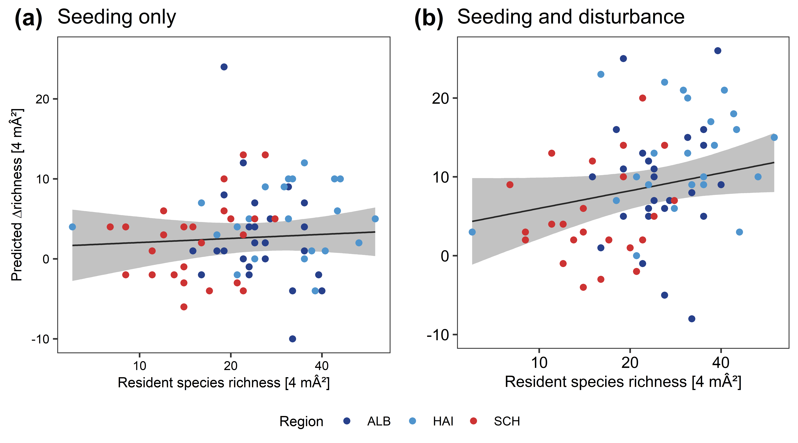

```{r setup, include=FALSE}
knitr::opts_chunk$set(fig.pos = 'H') # prevent figures from floating around
knitr::opts_chunk$set(echo = FALSE, warning = FALSE)
library(kableExtra)
```

\newpage

# Experimental design

We established a 2\*2 factorial experiment with seeding and soil disturbance 
in 73 grasslands. 
The four experimental treatments (control, seeding only, 
seeding and disturbance, disturbance only) each had a size of 7 m\*7 m and were arranged 
in a rectangle (or sometimes in a row, if the grassland shape or site 
characteristics did not allow for a rectangle) with 2 m distance between treatments. 
Within each of the treatments, we surveyed vegetation in one 2 m \* 2 m quadrat 
and sampled biomass each year in four 0.25 m^2^ squares (Fig. \@ref(fig:design)). 
We sampled biomass in different squares on the control each year
because sampled soil cores after biomass sampling in some years, 
which would have affected biomass samples in the following years. 
See [@klaus2017] for further details on the experimental design.


```{r design, out.width = "100%", fig.cap = capdesign, echo=FALSE}
  knitr::include_graphics("figs/S1_design-SADE.pdf")
capdesign <- "Design of the seeding and disturbance experiment on the 73 grasslands under study.
(a) The four treatments (control, seeding, seeding and disturbance, disturbance) 
were arranged in a rectangle. (b) Within each treatment, we surveyed vegetation on 2 m * 2 m 
and sampled biomass on four 0.5 m * 0.5 m squares. We sampled biomass in different squares each year."
```


\newpage

# Seeding and disturbance effects on plant diversity

## Model formulas

### Plant species richness

```{=tex}
\begin{equation}
   \begin{aligned}
Species\ richness_i \sim\ &\text{Poisson}(\mu_i),\ with\\
 \text{log}(\mu_{i}) =\ &\alpha + \beta_1 * Disturbance_{i{[}j{]}{[}k{]}} 
 + \beta_2 * Seeding_{i{[}j{]}{[}k{]}}\\
 &+ \beta_3 * Disturbance_{i{[}j{]}{[}k{]}} * Seeding_{i{[}j{]}{[}k{]}} +\\ 
 &+ \beta_4 * Disturbance_{i{[}j{]}{[}k{]}} * Seeding_{i{[}j{]}{[}k{]}} * year2_{i{[}j{]}{[}k{]}}\\
 &+ \beta_5 * Disturbance_{i{[}j{]}{[}k{]}} * Seeding_{i{[}j{]}{[}k{]}} * year3_{i{[}j{]}{[}k{]}}\\
 &+ \beta_6 * Disturbance_{i{[}j{]}{[}k{]}} * Seeding_{i{[}j{]}{[}k{]}} * year4_{i{[}j{]}{[}k{]}}\\
 &+ \beta_7 * Disturbance_{i{[}j{]}{[}k{]}} * Seeding_{i{[}j{]}{[}k{]}} * year5_{i{[}j{]}{[}k{]}}\\  
 &+ Grassland_{i{[}j{]}} + RegionYear_{i{[}k{]}}\\
\\
Grassland_j &\sim \text{Normal}(0, \sigma_{Grassland})\\
RegionYear_k &\sim \text{Normal}(0, \sigma_{RegionYear})\\
   \end{aligned}
   (\#eq:eq01)
\end{equation}
```


### S~PIE~

```{=tex}
\begin{equation}
   \begin{aligned}
S_{PIE, i} \sim\ &\text{Gamma}(\mu_i,\phi)\\
 \text{log}(\mu_{i}) =\ &\alpha + \beta_1 * Disturbance_{i{[}j{]}{[}k{]}} 
 + \beta_2 * Seeding_{i{[}j{]}{[}k{]}}\\
 &+ \beta_3 * Disturbance_{i{[}j{]}{[}k{]}} * Seeding_{i{[}j{]}{[}k{]}} +\\ 
 &+ \beta_4 * Disturbance_{i{[}j{]}{[}k{]}} * Seeding_{i{[}j{]}{[}k{]}} * year2_{i{[}j{]}{[}k{]}}\\
 &+ \beta_5 * Disturbance_{i{[}j{]}{[}k{]}} * Seeding_{i{[}j{]}{[}k{]}} * year3_{i{[}j{]}{[}k{]}}\\
 &+ \beta_6 * Disturbance_{i{[}j{]}{[}k{]}} * Seeding_{i{[}j{]}{[}k{]}} * year4_{i{[}j{]}{[}k{]}}\\
 &+ \beta_7 * Disturbance_{i{[}j{]}{[}k{]}} * Deeding_{i{[}j{]}{[}k{]}} * year5_{i{[}j{]}{[}k{]}}\\  
 &+ Grassland_{i{[}j{]}} + RegionYear_{i{[}k{]}}\\
\\
Grassland_j &\sim \text{Normal}(0, \sigma_{Grassland})\\
RegionYear_k &\sim \text{Normal}(0, \sigma_{RegionYear})\\
   \end{aligned}
   (\#eq:eq02)
\end{equation}
```
\

### Priors for the species richness and S~PIE~ models:

```{=tex}
\begin{equation}
   \begin{aligned}
\alpha &\sim \text{StudentT}(\nu = 3 ,\mu = 3, \sigma = 10)\\
\beta &\sim \text{Normal}(\mu = 0 ,\sigma = 2) \\
\tfrac{1}{\phi} &\sim \text{Gamma}(\alpha = 0.01 ,\beta = 0.01) \\
\sigma_{Grassland} &\sim \text{StudentT}(\nu = 3 ,\mu = 3, \sigma = 10),\ \text{constrained to be positive}\\ 
\sigma_{RegionYear} &\sim \text{StudentT}(\nu = 3 ,\mu = 3, \sigma = 10),\ \text{constrained to be positive}\\ 
   \end{aligned}
   (\#eq:eq03)
\end{equation}
```

Because both species richness and S~PIE~ were modelled with log-link, we specified identical priors for $\beta$. 
$Disturbance_{i{[}j{]}{[}k{]}}$, $seeding_{i{[}j{]}{[}k{]}}$ and $year_{i{[}j{]}{[}k{]}}$ are dummy variables for treatments and year for $Grassland_j$ and $RegionYear_k$
$Grassland_j$ is the grassland site grouping factor (73 grasslands) 
and $RegionYear_k$ is the region times year interaction grouping factor 
(three regions and five years).


## Model diagnostics


```{r treatment-ppcheck, out.width = "75%", fig.cap = captreatmentppcheck, echo=FALSE}
  knitr::include_graphics("figs/S1_pp-check-treatment-effects.pdf")
captreatmentppcheck <- "Kernel density estimates of observations ($y$) for (a) species richness and (b) S\\textsubscript{PIE}, and 50 draws from the ($y_{rep}$) posterior predictive distribution. "
```

\newpage

## Parameter credible intervals

```{r treatment-table, results='asis'}
library(kableExtra)
options(knitr.kable.NA = "")

treatmenttable <- read.table("tables/treatment-cis.txt", sep ="\t", 
                             dec = ".", header = T)

captreatmenttable <- "Effects of seeding, 
disturbance, year and their interactions on plant species richness and S\\textsubscript{PIE} diversity in the 73 grasslands. 
Given here are the mean and the 90\\% credible interval and effective sample size of the posterior samples. 
Parameter effects are additive, i.e. the species richness on the seeding only treatment 
in year five is the sum of the intercept, the seeding main effect, the year five effect
and the seeding times year five interaction. 
Credible intervals which do not overlap zero are shown in bold.
Note that species richness was modelled assuming Poisson errors with log-link, 
while S\\textsubscript{PIE} was modelled as Gamma distributed with log-link.
R-hat values <1.01 for all parameters indicated chain convergence."

bold.rich <-  c(ifelse(sign(treatmenttable$X5.[1:20]) ==
                       sign(treatmenttable$X95.[1:20]),
                     TRUE, FALSE), rep(FALSE, 5) )

bold.spie <-  c(ifelse(sign(treatmenttable$X5..1[1:20]) ==
                       sign(treatmenttable$X95..1[1:20]),
                     TRUE, FALSE), rep(FALSE, 5) )

rownames(treatmenttable) <- c("Intercept", "Disturbance", "Seeding", "Year 2", 
                             "Year 3", "Year 4", "Year 5", "Disturbance*Seeding", 
                             "Disturbance*Year 2", "Disturbance*Year 3", 
                             "Disturbance*Year 4", "Disturbance*Year 5", 
                             "Seeding*Year 2", "Seeding*Year 3", 
                             "Seeding*Year 4", "Seeding*Year 5", 
                             "Disturbance*Seeding*Year 2", "Disturbance*Seeding*Year 3", 
                             "Disturbance*Seeding*Year 4", "Disturbance*Seeding*Year 5", 
                             "SD Grassland", "SD RegionYear", 
                             "$\\phi$", "$R_{cond}^2$", "$R_{marg}^2$" )


kbl(treatmenttable, caption = captreatmenttable,
    booktabs = TRUE,  escape = FALSE, digits = 2, 
    row.names = TRUE, align = c("lcccccccc"),
    linesep = "", 
    col.names = c("\\SI{5}{\\percent}", "\\SI{50}{\\percent} ",
                  "\\SI{95}{\\percent} ", "N\\textsubscript{eff}", 
                  "\\SI{5}{\\percent} ", "\\SI{50}{\\percent} ",
                  "\\SI{95}{\\percent} ", "N\\textsubscript{eff}") 
     ) %>%
   kable_styling(latex_options = c("striped", "HOLD_position"),
                 position = "left", font_size = 10) %>%
   column_spec(2:4, bold = bold.rich ) %>%
   column_spec(6:8, bold = bold.spie ) %>%
   add_header_above(c(" ", "Species richness" = 4, "S_PIE" = 4),
                    escape = TRUE)
```


\newpage

# Treatment effects over time on litter cover and bare soil

```{r cover, out.width = "100%", fig.cap = capcover, echo=FALSE}
  knitr::include_graphics("figs/03_litter-veg-soil-cover.pdf")
capcover <- "Cover of (a) vegetation, (b) litter and (c) bare soil 
on the experimental treatments in the three regions as estimated 
during field sampling, as estimated visually. 
Topsoil disturbance decreased vegetation and litter cover 
and increased bare soil cover in the first year, but this effect vanished quickly. 
Note that there are considerable observer effects on cover estimates. 
For instance, the main observers in the ALB and HAI region changed after year 3,
which led to large changes in estimated vegetation and litter covers."
```


\newpage

# Direct and indirect effects of land use on enrichment

## Model formulas

### $\Delta$richness of sown species between seeding treatments and control

```{=tex}
\begin{equation}
   \begin{aligned}
\Delta\ richness\ 1st\ year_i\ \sim &\ \text{Normal}(\mu_i,\sigma_{1st\ year})\\
\mu_i\ =\ &\alpha  + \beta_1 * \text{log}(Grazing_i + 1) + \beta_2 * Mowing_i\\
 &+ \beta_3 * \text{log}(Productivity_i)\\
 &+ \beta_4 * RegionHAI_i + \beta_5 * RegionSCH_i\\ 
   \end{aligned}
   (\#eq:eq04)
\end{equation}
```
```{=tex}
\begin{equation}
   \begin{aligned}
\Delta\ richness\ 5th\ year_i\ \sim\ &\text{Normal}(\mu_i,\sigma_{5th\ year})\\
\mu_i = &\ \alpha  + \beta_1 * \text{log}(Grazing_i + 1) + \beta_2 * Mowing_i\\
 &+ \beta_3 * \text{log}(Productivity_i)\\
 &+ \beta_4 * RegionHAI_i + \beta_5 * RegionSCH_i\\ 
 &+ \beta_6 * \Delta\ richness\ 1st\ year_i
   \end{aligned}
   (\#eq:eq05)
\end{equation}
```
```{=tex}
\begin{equation}
   \begin{aligned}
Productivity_i &\sim \text{Gamma}(\mu_i,\phi)\\
\text{log}(\mu_{i}) = &\ \alpha + \beta_1 * \text{log}(Fertilization_i + 1) \\
&+ \beta_2 * RegionHAI_i + \beta_3 * RegionSCH_i\\ 
   \end{aligned}
   (\#eq:eq06)
\end{equation}
```
```{=tex}
\begin{equation}
   \begin{aligned}
Biomass_{j{[}i{]}} &\sim \text{Normal}(Productivity_i,\sigma_{error})\\
   \end{aligned}
   (\#eq:eq07)
\end{equation}
```

*Priors for* $\Delta$richness in first and fifth year models (6, 7):

```{=tex}
\begin{equation}
   \begin{aligned}
\alpha &\sim \text{StudentT}(\nu = 3 ,\mu = 3, \sigma = 10)\\
\beta &\sim \text{Normal}(\mu = 0 ,\sigma = 10) \\
\sigma &\sim \text{Cauchy}(\mu = 0, \sigma = 10),\ \text{constrained to be positive}\\ 
   \end{aligned}
   (\#eq:eq08)
\end{equation}
```

*Priors for productivity model (8)*:

```{=tex}
\begin{equation}
   \begin{aligned}
\alpha &\sim \text{StudentT}(\nu = 3 ,\mu = 3, \sigma = 10)\\
\beta &\sim \text{Normal}(\mu = 0 ,\sigma = 10) \\
\sigma &\sim \text{Cauchy}(\mu = 0, \sigma = 10),\ \text{constrained to be positive}\\ 
   \end{aligned}
   (\#eq:eq09)
\end{equation}
```

*Priors for productivity measurement error model (9)*:

```{=tex}
\begin{equation}
   \begin{aligned}
Productivity_i &\sim \text{Normal}(\mu = GrasslandMean_i, \sigma = GrasslandSD_i)\\
\sigma &\sim \text{Cauchy}(\mu = 0, \sigma = 150),\ \text{constrained to be positive,}\\ 
   \end{aligned}
   (\#eq:eq10)
\end{equation}
```


$\Delta\ richness\ 1st\ year_i$ and $\Delta\ richness\ 5th\ year_i$ are the 
absolute differences in sown species richness 
(i.e. not considering unsown species when calculating richness)
the respective seeding treatment and the control, $Grazing_i$ is the mean 
grazing intensity (in livestock unit \* grazing days ha^-1^), $Mowing_i$ 
the mean number of cuts per year and $Fertilization_i$ is the mean 
amount of fertilizer applied (kg Nitrogen ha^-1^). $Region_{HAI}$ 
and $Region_{SCH}$ are dummy variables for the region, with $Region_{ALB}$ 
as the reference level.

$Biomass_{j{[}i{]}}$ is the harvested biomass (g m^-2^) of year $j$ in grassland site $i$ 
and $Productivity_i$ the latent 'true' productivity of 
grassland site $i$ with measurement error $\sigma$. $GrasslandMean_i$ 
and $GrasslandSD_i$ represent informed priors for $Productivity_i$, 
derived as the arithmetic mean and standard deviation of the 
harvested biomass on grassland site $i$ across the five years of this study. 
All predictors were scaled to zero mean and unit SD to make effect sizes comparable.

We fitted models with $\Delta\ richness$ of total species richness 
(i.e., species richness including species which were not sown, 
such as ruderal species) using identical model specifications.


## Predictor variable distributions

```{r multivariate-predictors, out.width = "100%", fig.cap = capmultivariatepredictors, echo=FALSE}
  knitr::include_graphics("figs/03_land-use-productivity-distribution.pdf")
capmultivariatepredictors <- "Distribution (diagonal), pairwise scatterplots (lower panels) and correlations 
of predictor variables among regions (upper panels) as used in the models on direct and indirect effects 
of land use on the number of established species ($\\Delta$richness). 
Fertilization intensity (in kg N ha\\textsuperscript{-1})
and grazing intensity (in livestock unit grazing days ha\\textsuperscript{-1} 
were $log(x + 1)$ transformed. Productivity (in aboveground biomass g m\\textsuperscript{-2}) 
was log-transformed and mowing intensity is the mean number of cuts per year.
Three grasslands in the ALB region had very low productivity,
but parameter estimates were robust to the exclusion of the three grasslands"
```


## Parameter credible intervals

```{r sem-table, results='asis'}
library(kableExtra)
options(knitr.kable.NA = "")

semtable <- read.table("tables/CIs-establishment-delta-sown-richness.txt", 
                       sep ="\t", dec = ".", header = T)

capsemtable <- "Direct and indirect land-use 
and region effects on sown species $\\Delta$richness, i.e. the
difference in sown species richness between the respective treatment and the control. 
Given here are the mean and the 90\\% credible interval 
and effective sample size of the posterior samples. 
Explained variation of $\\Delta$richness in the first year 
and in the seeding treatment in general was low. 
In the combined treatment, land use had an indirect negative effect 
on $\\Delta$richness through productivity. 
Intercepts of the $\\Delta$richness models refer to estimated means 
in the Alb region given average predictor values, 
and the intercept of the productivity model refers to zero fertilization in the Alb region. 
90\\% credible intervals that do not overlap zero are highlighted in bold. 
Productivity (biomass g m\\textsuperscript{-2}) in both
models was modelled as latent with measurement error $\\sigma$. 
R-hat values <1.01 for all parameters indicated chain convergence."

bold.seed.only <-  c(
  c(ifelse(sign(semtable$X5.[1:6]) == sign(semtable$X95.[1:6]),
                     TRUE, FALSE), rep(FALSE, 1) ),
  c(ifelse(sign(semtable$X5.[8:14]) == sign(semtable$X95.[8:14]),
                     TRUE, FALSE), rep(FALSE, 1) ),
  c(ifelse(sign(semtable$X5.[16:19]) == sign(semtable$X95.[16:19]),
                     TRUE, FALSE), rep(FALSE, 5) )
  )

bold.seed.disturb <-  c(
  c(ifelse(sign(semtable$X5..1[1:6]) == sign(semtable$X95..1[1:6]),
                     TRUE, FALSE), rep(FALSE, 1) ),
  c(ifelse(sign(semtable$X5..1[8:14]) == sign(semtable$X95..1[8:14]),
                     TRUE, FALSE), rep(FALSE, 1) ),
  c(ifelse(sign(semtable$X5..1[16:19]) == sign(semtable$X95..1[16:19]),
                     TRUE, FALSE), rep(FALSE, 5) )
  )


kbl(semtable, caption = capsemtable,
    booktabs = TRUE,  escape = FALSE, digits = 2, 
    row.names = FALSE, align = c("lcccccccc"),
    linesep = "", 
    col.names = c(" ", "\\SI{5}{\\percent}", "\\SI{50}{\\percent} ",
                  "\\SI{95}{\\percent} ", "N\\textsubscript{eff}", 
                  "\\SI{5}{\\percent} ", "\\SI{50}{\\percent} ",
                  "\\SI{95}{\\percent} ", "N\\textsubscript{eff}") 
     ) %>%
   kable_styling(latex_options = c("striped", "HOLD_position"),
                 position = "left", font_size = 10) %>%
   column_spec(2:4, bold = bold.seed.only ) %>%
   column_spec(6:8, bold = bold.seed.disturb ) %>%
   add_header_above(c(" ", "Seeding only" = 4, "Seeding and disturbance" = 4) ) %>%
   group_rows("$\\Delta$ richness 1st year", 1, 7, escape = FALSE) %>%
   group_rows("$\\Delta$ richness 5th year", 8, 15, escape = FALSE) %>%
   group_rows("Productivity", 16, 21) %>%
   group_rows("Bayes $R^2$", 22, 24, escape = FALSE)
```


```{r sem-table2, results='asis'}
library(kableExtra)
options(knitr.kable.NA = "")

semtable2 <- read.table("tables/CIs-establishment-delta-richness.txt", 
                       sep ="\t", dec = ".", header = T)

capsemtable2 <- "Direct and indirect land-use 
and region effects on $\\Delta$richness, i.e. the
difference in plant species richness between the respective treatment and the control,
including all species. 
$\\Delta$richness of sown species and all species did not differ on the 
seeding only treatment in either year (see Table S2 above).
On the seeding and disturbance treatment, mean $\\Delta$richness of all species 
is almost four species higher than sown species' $\\Delta$richness in the first year
(ALB region Intercept 1st year here: median 9.84, sown species $\\Delta$richness: median 6.10;
similar pattern for HAI and SCH region effects), 
which indicates that ruderal species from the soil seed bank contributed 
considerably to initial increases in species richness.
In the 5th year, $\\Delta$richness of sown or all species only differed slightly 
(ALB region intercept and HAI and SCH region effects), which implies
that ruderal species have disappeared and mostly sown species have established. 
Given here are the mean and the 90\\% credible interval and effective sample size 
of the posterior samples. 
90\\% credible intervals that do not overlap zero are highlighted in bold. 
R-hat values <1.01 for all parameters indicated chain convergence."

bold.seed.only <-  c(
  c(ifelse(sign(semtable2$X5.[1:6]) == sign(semtable2$X95.[1:6]),
                     TRUE, FALSE), rep(FALSE, 1) ),
  c(ifelse(sign(semtable2$X5.[8:14]) == sign(semtable2$X95.[8:14]),
                     TRUE, FALSE), rep(FALSE, 1) ),
  c(ifelse(sign(semtable2$X5.[16:19]) == sign(semtable2$X95.[16:19]),
                     TRUE, FALSE), rep(FALSE, 5) )
  )

bold.seed.disturb <-  c(
  c(ifelse(sign(semtable2$X5..1[1:6]) == sign(semtable2$X95..1[1:6]),
                     TRUE, FALSE), rep(FALSE, 1) ),
  c(ifelse(sign(semtable2$X5..1[8:14]) == sign(semtable2$X95..1[8:14]),
                     TRUE, FALSE), rep(FALSE, 1) ),
  c(ifelse(sign(semtable2$X5..1[16:19]) == sign(semtable2$X95..1[16:19]),
                     TRUE, FALSE), rep(FALSE, 5) )
  )


kbl(semtable2, caption = capsemtable2,
    booktabs = TRUE,  escape = FALSE, digits = 2, 
    row.names = FALSE, align = c("lcccccccc"),
    linesep = "", 
    col.names = c(" ", "\\SI{5}{\\percent}", "\\SI{50}{\\percent} ",
                  "\\SI{95}{\\percent} ", "N\\textsubscript{eff}", 
                  "\\SI{5}{\\percent} ", "\\SI{50}{\\percent} ",
                  "\\SI{95}{\\percent} ", "N\\textsubscript{eff}") 
     ) %>%
   kable_styling(latex_options = c("striped", "HOLD_position"),
                 position = "left", font_size = 10) %>%
   column_spec(2:4, bold = bold.seed.only ) %>%
   column_spec(6:8, bold = bold.seed.disturb ) %>%
   add_header_above(c(" ", "Seeding only" = 4, "Seeding and disturbance" = 4) ) %>%
   group_rows("$\\Delta$ richness 1st year", 1, 7, escape = FALSE) %>%
   group_rows("$\\Delta$ richness 5th year", 8, 15, escape = FALSE) %>%
   group_rows("Productivity", 16, 21) %>%
   group_rows("Bayes $R^2$", 22, 24, escape = FALSE)
```


## Model diagnostics


```{r multivariate-ppcheck, out.width = "100%", fig.cap = capmultivariateppcheck, echo=FALSE}
  knitr::include_graphics("figs/S1_pp-check-multivariate.pdf")
capmultivariateppcheck <- "Kernel density estimates of observations ($y$) 
and 50 draws from the ($y_{rep}$) posterior predictive distribution 
for $\\Delta$richness in (a) the first and (b) fifth year on the 
seeding only and (c, d) seeding and disturbance treatment. (d) to (g) refer 
to the same models with sown species $\\Delta$richness as response $y$."
```


\newpage

# Plant functional trait effects on establishment

## Model formulas

```{=tex}
\begin{equation}
   \begin{aligned}
Establishment\ success_i \sim\ &\text{Bernoulli}(\mu_i),\ with\\
 \text{logit}(\mu_i) = &\ \alpha \\
 &+ \beta_1 * Live\ seeding\ density_{i{[}j{]}{[}k{]}}\\
 &+ \beta_3 * \text{log}(Height_{i{[}j{]}})\\
 &+ \beta_4 * \text{log}(Seed\ mass_{i{[}j{]}})\\ 
 & + \beta_5 * SLA_{i{[}j{]}} \\ 
 &+ \beta_6 * \text{log}(Productivity_{i{[}k{]}})\\
 &+ \beta_7 * \text{log}(Productivity_{i{[}k{]}}) * \text{log}(Height_{i{[}j{]}})\\
 &+ \beta_8 * \text{log}(Productivity_{i{[}k{]}}) * \text{log}(Seed\ mass_{i{[}j{]}})\\
 &+ \beta_9 * \text{log}(Productivity_{i{[}k{]}}) * SLA_{i{[}j{]}}\\
 &+ Species_{i{[}j{]}} + Grassland_{i{[}k{]}}\\
\\
Species_j &\sim \text{Normal}(0, \sigma_{Species})\\
Grassland_k &\sim \text{Normal}(0, \sigma_{Grassland})\\
   \end{aligned}
   (\#eq:eq11)
\end{equation}
```
```{=tex}
\begin{equation}
   \begin{aligned}
Biomass_{l{[}k{]}} &\sim \text{Normal}(Productivity_k,\sigma_{error})\\
   \end{aligned}
   (\#eq:eq12)
\end{equation}
```
*Priors for establishment model (11)*:

```{=tex}
\begin{equation}
   \begin{aligned}
\alpha &\sim \text{StudentT}(\nu = 3 ,\mu = 3, \sigma = 10)\\
\beta &\sim \text{Normal}(\mu = 0 ,\sigma = 5) \\
\sigma_{species} &\sim \text{StudentT}(\nu = 3 ,\mu = 3, \sigma = 10),\ \text{constrained to be positive}\\ 
\sigma_{grassland} &\sim \text{StudentT}(\nu = 3 ,\mu = 3, \sigma = 10),\ \text{constrained to be positive}\\ 
   \end{aligned}
   (\#eq:eq13)
\end{equation}
```
*Priors for productivity measurement error model (12)*:

```{=tex}
\begin{equation}
   \begin{aligned}
Productivity_k &\sim \text{Normal}(\mu = GrasslandMean_k, \sigma = GrasslandSD_k)\\
\sigma &\sim \text{Cauchy}(\mu = 0, \sigma = 150),\ \text{constrained to be positive,}\\ 
   \end{aligned}
   (\#eq:eq14)
\end{equation}
```

We coded $Establishment\ success_i$ as binary and assumed successful
establishment if the sown species has been recorded on the respective seeding 
treatment in the 5th year of the experiment.
$Live\ seeding\ density_{i{[}j{]}{[}k{]}}$ is the product of seed germination rate
and seeding density of species $j$ (dependent on seed mass, see Methods) in region $k$. 
$Height_{i{[}j{]}}$, $Seed mass_{i{[}j{]}}$ and $Specific\ leaf\ area_{i{[}j{]}}$ 
[from the LEDA Traitbase, @kleyer2008], 
$Productivity_{i{[}k{]}}$ and interactions of traits with productivity were used as predictors. 
We included varying intercepts for species $j$ ($Species_{i{[}j{]}}$) 
and grassland $k$ ($Grassland_{i{[}k{]}}$).
$Productivity_k$ was again modelled as latent as in the models on 
land-use effects on the number of established sown species.

grazing intensity (in livestock unit \* grazing days ha^-1^), $Mowing_i$ 
the mean number of cuts per year and $Fertilization_i$ is the mean 
amount of fertilizer applied (kg Nitrogen ha^-1^). $Region_{HAI}$ 
and $Region_{SCH}$ are dummy variables for the region, with $Region_{ALB}$ 
as the reference level.

$Biomass_{i,j}$ is the harvested biomass (g m^-2^) in grassland site $i$ 
and year $j$ and $Productivity_i$ the latent 'true' productivity of 
grassland site $i$ with measurement error $\sigma$. $GrasslandMean_i$ 
and $GrasslandSD_i$ represent informed priors for $Productivity_i$, 
derived as the arithmetic mean and standard deviation of the 
harvested biomass on grassland site $i$ across the five years of this study. 
All predictors were scaled to zero mean and unit SD to make effect sizes comparable.

We fitted models with $\Delta\ richness$ of total species richness 
(i.e., species richness including species which were not sown, 
such as ruderal species) using identical model specifications.


## Predictor variable distributions

```{r trait-predictors, out.width = "100%", fig.cap = captraitpredictors, echo=FALSE}
  knitr::include_graphics("figs/03_traits-predictor-distribution.pdf")
captraitpredictors <- "Distribution (diagonal), pairwise scatterplots (lower panels) and correlations 
(upper panels) of traits, leve seeding density and productivity
among the three regions. 
Plant height (in meter), seed mass (in mg) and productivity 
(in aboveground biomass g m\\textsuperscript{-2}) were log-transformed
as used in the models on trait and trait-productivity effects on species establishment.
Live seeding density was calculates as the product of germination rate per species and region
and the three seeding density categories 
(based on seed mass, high: 100 seeds m\\textsuperscript{−2} if seed mass < 1 mg, 
medium: 34 seeds m\\textsuperscript{−2} between 1 mg and 10 mg, 
low: 17 seeds m\\textsuperscript{−2} > 10 mg)."
```


## Model diagnostics


```{r traits-ppcheck, out.width = "75%", fig.cap = captraitsppcheck, echo=FALSE}
  knitr::include_graphics("figs/S1_pp-check-traits-establishment.pdf")
captraitsppcheck <- "Kernel density estimates of observations ($y$) 
and 50 draws from the ($y_{rep}$) posterior predictive distribution 
for establishment success of plant species on (a) the seeding only 
and (b) the seeding and disturbance treatment."
```


## Parameter credible intervals

```{r traits-table, results='asis'}
library(kableExtra)
options(knitr.kable.NA = "")

traittable <- read.table("tables/trait-cis.txt", sep ="\t", 
                         dec = ".", header = T, row.names = 1)

captraittable <- "Effects of traits, productivity and 
trait-productivity interactions on the establishment success of sown species 
on the seeding only and seeding and disturbance treatment. 
Establishment in the fifth year of the experiment was modelled with logistic regression. 
Given here are the mean and the 90\\% credible interval 
and effective sample size of the posterior samples. 
The intercept refers to centred predictors, i.e. the average probability 
of establishment at average predictor values. 
All parameters but SLA were log-transformed and scaled to unit SD 
to compare effect sizes. 
Varying intercepts for species and grassland were included.
Credible intervals which do not overlap zero are shown in bold."

bold.seed.only <-  c(ifelse(sign(traittable$X5.[1:9]) ==
                            sign(traittable$X95.[1:9]),
                            TRUE, FALSE), rep(FALSE, 5) )

bold.seed.disturb <-  c(ifelse(sign(traittable$X5..1[1:9]) ==
                               sign(traittable$X95..1[1:9]),
                               TRUE, FALSE), rep(FALSE, 5) )

kbl(traittable, caption = captraittable,
    booktabs = TRUE,  escape = FALSE, digits = 2, 
    row.names = TRUE, align = c("lcccccccc"),
    linesep = "", 
    col.names = c("\\SI{5}{\\percent}", "\\SI{50}{\\percent} ",
                  "\\SI{95}{\\percent} ", "N\\textsubscript{eff}", 
                  "\\SI{5}{\\percent} ", "\\SI{50}{\\percent} ",
                  "\\SI{95}{\\percent} ", "N\\textsubscript{eff}") 
     ) %>%
   kable_styling(latex_options = c("striped", "HOLD_position"),
                 position = "left", font_size = 10) %>%
   column_spec(2:4, bold = bold.seed.only ) %>%
   column_spec(6:8, bold = bold.seed.disturb ) %>%
   add_header_above(c(" ", "Seeding only" = 4, "Seeding and disturbance" = 4),
                    escape = FALSE)
```


## Model comparison of trait effects on establishment with grazing- and mowing-trait interactions

To investigate whether additional trait-environment interactions, i.e. interactions with grazing and mowing, influenced establishment, we modelled establishment with additional i) grazing and grazing-trait interactions, ii) grazing and grazing-trait interactions and iii) both grazing- and mowing-trait interactions as predictors. We used leave-one-out cross-validation (LOO) to compare model performances using the *loo* package [@vehtari2017; @vehtari2020].

The grazing- and mowing-trait interactions alone have weak effects on the establishment of sown species in both seeding treatments (Tables \ref{tab:trait-mow-graz-seed-only-table} and \ref{tab:trait-mow-graz-seed-disturb-table}). However, for the seeding only treatment the model including all productivity-, grazing- and mowing-trait interactions show additional positive effects of mowing and grazing intensity as well as a negative SLA\*grazing interaction. Despite, based on the LOO expected log pointwise predictive density for a new dataset (elpd~LOO~), we assume the predictive performance of models with grazing- and/or mowing-trait interactions to be equivalent to the predictive performance of the 'simplest' model with only productivity-trait interactions (Table \ref{tab:trait-mow-graz-comparison}). We therefore only report the results of the productivity-trait model in the main text to avoid the complex interpretation of both grazing- and mowing-trait interactions in the presence of productivity-trait interactions.

```{r trait-mow-graz-seed-only-table, results='asis'}
library(kableExtra)
options(knitr.kable.NA = "")

traitmowgrazseedonlytable <- read.table("tables/trait-mow-graz-seeding-only-ci.txt", sep ="\t", 
                         dec = ".", header = T, row.names = 1)

captraitmowgrazseedonlytable <- "Effects of traits, productivity and 
trait-productivity interactions on the establishment success of sown species 
on the seeding only treatment.  
Establishment in the fifth year of the experiment was modelled exactly as 
for trait-productivity interactions only, but with additional grazing-, mowing- 
and grazing- and mowing-trait interactions.
Given here are the mean and the 90\\% credible interval 
and effective sample size of the posterior samples. 
The intercept refers to centred predictors, i.e. the average probability 
of establishment at average predictor values. 
All parameters but SLA and mowing frequency were log-transformed 
and scaled to unit SD to compare effect sizes. 
Varying intercepts for species and grassland were included.
Credible intervals which do not overlap zero are shown in bold. "

rownames(traitmowgrazseedonlytable) <- c("Intercept", 
                                         "Live seeding density", 
                                         "Height (log.)", 
                                         "Seed mass (log.)", "SLA", 
                                         "Productivity (log.)", 
                                         "Height*Productivity", 
                                         "Seed mass*Productivity", 
                                         "SLA*Productivity", 
                                         "Grazing (log.)", 
                                         "Height*Grazing", 
                                         "Seed mass*Grazing", 
                                         "SLA*Grazing",
                                         "Mowing",
                                         "Height*Mowing", 
                                         "Seed mass*Mowing", 
                                         "SLA*Mowing", 
                                         "SD Grassland",
                                         "SD Species", 
                                         "$\\sigma$ Productivity"
                                         )

bold.graz <-  c(ifelse(sign(traitmowgrazseedonlytable$X5.[1:13]) ==
                            sign(traitmowgrazseedonlytable$X95.[1:13]),
                            TRUE, FALSE), rep(FALSE, 7) )

bold.mow <-  c(ifelse(sign(traitmowgrazseedonlytable$X5..1[1:9]) ==
                               sign(traitmowgrazseedonlytable$X95..1[1:9]),
                               TRUE, FALSE), rep(FALSE, 4),
               ifelse(sign(traitmowgrazseedonlytable$X5..1[14:17]) ==
                               sign(traitmowgrazseedonlytable$X95..1[14:17]),
                               TRUE, FALSE), rep(FALSE, 3) )

bold.graz.mow <-  c(ifelse(sign(traitmowgrazseedonlytable$X5..2[1:17]) ==
                               sign(traitmowgrazseedonlytable$X95..2[1:17]),
                               TRUE, FALSE), rep(FALSE, 3) )

kbl(traitmowgrazseedonlytable, caption = captraitmowgrazseedonlytable,
    booktabs = TRUE,  escape = FALSE, digits = 2, 
    row.names = TRUE, align = c("ccccccccc"),
    linesep = "", 
    col.names = c("\\SI{5}{\\percent}", "\\SI{50}{\\percent} ",
                  "\\SI{95}{\\percent} ", "N\\textsubscript{eff}", 
                  "\\SI{5}{\\percent}", "\\SI{50}{\\percent} ",
                  "\\SI{95}{\\percent} ", "N\\textsubscript{eff}", 
                  "\\SI{5}{\\percent} ", "\\SI{50}{\\percent} ",
                  "\\SI{95}{\\percent} ", "N\\textsubscript{eff}") 
     ) %>%
   kable_styling(latex_options = c("striped", "HOLD_position"),
                 position = "left", font_size = 9) %>%
   column_spec(2:4, bold = bold.graz ) %>%
   column_spec(6:8, bold = bold.mow ) %>%
   column_spec(10:12, bold = bold.graz.mow ) %>%
   add_header_above(c(" ", "plus Grazing" = 4, "plus Mowing" = 4,
                      "plus Grazing and Mowing" = 4),
                    escape = FALSE)
```


```{r trait-mow-graz-seed-disturb-table, results='asis'}
library(kableExtra)
options(knitr.kable.NA = "")

traitmowgrazseeddisturbtable <- read.table("tables/trait-mow-graz-seeding-disturbance-ci.txt", sep ="\t", 
                         dec = ".", header = T, row.names = 1)

captraitmowgrazseeddisturbtable <- "Effects of traits, productivity and 
trait-productivity interactions on the establishment success of sown species 
on the seeding and disturbance treatment.  
Establishment in the fifth year of the experiment was modelled exactly as 
for trait-productivity interactions only, but with additional grazing-, mowing- 
and grazing- and mowing-trait interactions.
Given here are the mean and the 90\\% credible interval 
and effective sample size of the posterior samples. 
The intercept refers to centred predictors, i.e. the average probability 
of establishment at average predictor values. 
All parameters but SLA and mowing frequency were log-transformed 
and scaled to unit SD to compare effect sizes. 
Varying intercepts for species and grassland were included.
Credible intervals which do not overlap zero are shown in bold."

rownames(traitmowgrazseeddisturbtable) <- c("Intercept", 
                                         "Live seeding density", 
                                         "Height (log.)", 
                                         "Seed mass (log.)", "SLA", 
                                         "Productivity (log.)", 
                                         "Height*Productivity", 
                                         "Seed mass*Productivity", 
                                         "SLA*Productivity", 
                                         "Grazing (log.)", 
                                         "Height*Grazing", 
                                         "Seed mass*Grazing", 
                                         "SLA*Grazing",
                                         "Mowing",
                                         "Height*Mowing", 
                                         "Seed mass*Mowing", 
                                         "SLA*Mowing", 
                                         "SD Grassland",
                                         "SD Species", 
                                         "$\\sigma$ Productivity"
                                         )


bold.graz <-  c(ifelse(sign(traitmowgrazseeddisturbtable$X5.[1:13]) ==
                            sign(traitmowgrazseeddisturbtable$X95.[1:13]),
                            TRUE, FALSE), rep(FALSE, 7) )

bold.mow <-  c(ifelse(sign(traitmowgrazseeddisturbtable$X5..1[1:9]) ==
                               sign(traitmowgrazseeddisturbtable$X95..1[1:9]),
                               TRUE, FALSE), rep(FALSE, 4),
               ifelse(sign(traitmowgrazseeddisturbtable$X5..1[14:17]) ==
                               sign(traitmowgrazseeddisturbtable$X95..1[14:17]),
                               TRUE, FALSE), rep(FALSE, 3) )

bold.graz.mow <-  c(ifelse(sign(traitmowgrazseeddisturbtable$X5..2[1:17]) ==
                               sign(traitmowgrazseeddisturbtable$X95..2[1:17]),
                               TRUE, FALSE), rep(FALSE, 3) )

kbl(traitmowgrazseeddisturbtable, caption = captraitmowgrazseeddisturbtable,
    booktabs = TRUE,  escape = FALSE, digits = 2, 
    row.names = TRUE, align = c("ccccccccc"),
    linesep = "",  
    col.names = c("\\SI{5}{\\percent}", "\\SI{50}{\\percent} ",
                  "\\SI{95}{\\percent} ", "N\\textsubscript{eff}", 
                  "\\SI{5}{\\percent}", "\\SI{50}{\\percent} ",
                  "\\SI{95}{\\percent} ", "N\\textsubscript{eff}", 
                  "\\SI{5}{\\percent} ", "\\SI{50}{\\percent} ",
                  "\\SI{95}{\\percent} ", "N\\textsubscript{eff}") 
     ) %>%
      kable_styling(latex_options = c("striped", "HOLD_position"),
                 position = "left", font_size = 9) %>%
   column_spec(2:4, bold = bold.graz ) %>%
   column_spec(6:8, bold = bold.mow ) %>%
   column_spec(10:12, bold = bold.graz.mow ) %>%
   add_header_above(c(" ", "plus Grazing" = 4, "plus Mowing" = 4,
                      "plus Grazing and Mowing" = 4),
                    escape = FALSE)
```


```{r trait-mow-graz-comparison, results='asis'}
library(kableExtra)
options(knitr.kable.NA = "")

traitcomparisontable <- read.table("tables/trait-comparison-elpd.txt", sep ="\t", 
                         dec = ".", header = T)

captraitcomparisontable <- "Comparison of sown species' establishment models
with additional grazing- and mowing-trait interactions based on leave-one-out 
cross-validation. We used the expected leave-one-out prediction errors 
(which decrease with the expected log pointwise predictive density 
for a new dataset, elpd\\textsubscript{LOO}) to 
select the preferred model.
"

kbl(traitcomparisontable, caption = captraitcomparisontable,
    booktabs = TRUE,  escape = FALSE, digits = 2, 
    row.names = FALSE, align = c("lcccc"),
    linesep = "", 
    col.names = c(" ", "elpd\\textsubscript{LOO}", "SE(elpd\\textsubscript{LOO})",
                  "elpd\\textsubscript{diff}", "SE(elpd\\textsubscript{diff})") 
     ) %>%
   kable_styling(latex_options = c("striped", "HOLD_position"),
                 position = "left", font_size = 9) %>%
   group_rows("Seeding only", 1, 4) %>%
   group_rows("Seeding and disturbance", 5, 8)
```

\newpage

# Effects of region and resident species richness on $\Delta$richness

To test how $\Delta$richness relates to the resident species richness 
of the same site, we modelled $\Delta$richness with Gaussian errors 
as a function of region and resident species richness, which we log-transformed 
and scaled to unit SD. We specified weakly informative normal priors 
and default vague priors for the intercept. Increased $\Delta$richness 
was related to higher resident species richness in the fifth year in both, 
seeding only and seeding and disturbance, treatments 
(Fig. \@ref(fig:resident-richness), Table \@ref(tab:resident-richness-table)). 
We observed the highest increases in species richness through 
seeding and disturbance in already species-rich grasslands, 
whereas some species-poor grasslands did not gain any new species from either treatment.

```{r resident-richness, out.width = "75%", fig.cap = capresidentrich, echo=FALSE}
  
capresidentrich <- "Conditional effect of resident species richness on $\\Delta$richness 
after five years in a) the seeding and b) the seeding and disturbance treatment. 
Lines refer to the predicted median and 90\\% credible intervals of $\\Delta$richness, 
conditioned on the region Alb (see Table S8 for details)."
```

```{r resident-richness-table, results='asis'}
library(kableExtra)
options(knitr.kable.NA = "")

residentrichnesstable <- read.table("tables/delta-richness-resident-richness-cis.txt", sep ="\t", 
                             dec = ".", header = T)

capresidentrichnesstable <- "Effects of region 
and resident species richness on $\\Delta$richness. 
Given here are the mean and the 90\\% credible interval 
and effective sample size of the posterior samples. 
$\\Delta$richness in the fifth year was modelled as a function of region 
and resident species richness (log-transformed and scaled to unit SD) in the same year.
Credible intervals which do not overlap zero are shown in bold."

rownames(residentrichnesstable) <- c("Intercept (region ALB, centred predictor)",
                        "Resident richness (log.)", 
                        "Region HAI", "Region SCH", 
                        "$\\sigma$", "$R^2$")


bold.seed.only <-  c(ifelse(sign(residentrichnesstable$X5.[1:4]) ==
                             sign(residentrichnesstable$X95.[1:4]),
                     TRUE, FALSE), rep(FALSE, 2) )

bold.seed.disturb <-  c(ifelse(sign(residentrichnesstable$X5..1[1:4]) ==
                             sign(residentrichnesstable$X95..1[1:4]),
                     TRUE, FALSE), rep(FALSE, 2) )


kbl(residentrichnesstable, caption = capresidentrichnesstable,
    booktabs = TRUE,  escape = FALSE, digits = 2, 
    row.names = TRUE, align = c("lcccccccc"),
    linesep = "", 
    col.names = c("\\SI{5}{\\percent}", "\\SI{50}{\\percent} ",
                  "\\SI{95}{\\percent} ", "N\\textsubscript{eff}", 
                  "\\SI{5}{\\percent} ", "\\SI{50}{\\percent} ",
                  "\\SI{95}{\\percent} ", "N\\textsubscript{eff}") 
     ) %>%
   kable_styling(latex_options = c("striped", "HOLD_position"),
                 position = "left", font_size = 10) %>%
   column_spec(2:4, bold = bold.seed.only ) %>%
   column_spec(6:8, bold = bold.seed.disturb ) %>%
   add_header_above(c(" ", "Seeding only" = 4, "Seeding and disturbance" = 4),
                    escape = FALSE)
```

\newpage

# Cover of bare soil in relation to grazing, mowing and productivity

```{r bare-soil, out.width = "75%", fig.cap = capsoil, echo=FALSE}
  knitr::include_graphics("figs/03_soil-cover-grazing-mowing.pdf")
capsoil <- "Visual estimates of bare soil cover on the control in relation to (a) grazing and (b) mowing intensities (averaged over the five years of study) as used as predictors in the analyses. 
Bare soil cover is only weakly associated to grazing and mowing.
Lines denote linear model fits for each region separately."
```


\newpage

# Establishment rates of sown plant species

```{r sown-table-seeding-only, results='asis'}

tableseedingonly <- read.table("tables/sown-species-table-seeding-only.txt", 
                               sep ="\t", dec = ".", header = T, 
                               row.names = 1)

captableseedingonly <- "Establishment rates of sown plant species
in the seeding only treatment in the 73 grasslands in three regions. 
The number of grasslands a species was newly sown does not necessarily 
match the number of grasslands within a region because observations 
were omitted if a species was recorded in the control or disturbance treatment 
during the five years of the experiment. 
We assumed sown species to have successfully established 
if they were observed in the fifth year of the experiment."

kbl(tableseedingonly, longtable = TRUE, 
    caption = captableseedingonly, 
    booktabs = TRUE, digits = 0, 
    row.names = TRUE, align = c("cccccccc"),
    escape = FALSE,
    col.names = linebreak(c("Establishment\nsuccess \\%", 
                            "No.\nnewly sown", "No.\nestablished", 
                            "No.\nnewly sown", "No.\nestablished", 
                            "No.\nnewly sown", "No.\nestablished"),
                  align = "c") ) %>%
    add_header_above(c(" " = 2, "ALB" = 2, "HAI" = 2, "SCH" = 2),
                     escape = FALSE) %>%
    kable_styling(latex_options = c("striped", "repeat_header", "HOLD_position"),
                  repeat_header_method = c("replace"),
                  repeat_header_text = "Establishment rates of sown plant species
in the seeding only treatment \\textit{(continued)}",
                  position = "left", font_size = 9) %>%
    column_spec(1, italic = TRUE) %>%
    group_rows("Non-legume herbs", 1, 50) %>%
    group_rows("Legumes", 51, 57) %>%
    group_rows("Graminoids", 58, 73)
```

\newpage

```{r sown-table-seeding-disturb, results='asis'}

tableseedingdisturb <- read.table("tables/sown-species-table-seeding-disturbance.txt", 
                               sep ="\t", dec = ".", header = T, 
                               row.names = 1)

captableseedingdisturb <- "Establishment rates of sown plant species
in the seeding and disturbance treatment in the 73 grasslands in three regions. 
The number of grasslands a species was newly sown does not necessarily 
match the number of grasslands within a region because observations 
were omitted if a species was recorded in the control or disturbance treatment 
during the five years of the experiment. 
We assumed sown species to have successfully established 
if they were observed in the fifth year of the experiment."

kbl(tableseedingdisturb, longtable = TRUE, 
    caption = captableseedingdisturb, 
    booktabs = TRUE, digits = 0, 
    row.names = TRUE, align = c("cccccccc"),
    escape = FALSE, linesep = c(rep("", 4, "\\addlinespace")),
    col.names = linebreak(c("Establishment\nsuccess \\%", 
                            "No.\nnewly sown", "No.\nestablished", 
                            "No.\nnewly sown", "No.\nestablished", 
                            "No.\nnewly sown", "No.\nestablished"),
                  align = "c") ) %>%
    add_header_above(c(" " = 2, "ALB" = 2, "HAI" = 2, "SCH" = 2),
                     escape = FALSE) %>%
    kable_styling(latex_options = c("striped", "repeat_header", "HOLD_position"),
                  repeat_header_method = c("replace"),
                  repeat_header_text = "Establishment rates of sown plant species
in the seeding and disturbance treatment \\textit{(continued)}",
                  position = "left", font_size = 9) %>%
    column_spec(1, italic = TRUE) %>%
    group_rows("Non-legume herbs", 1, 50) %>%
    group_rows("Legumes", 51, 57) %>%
    group_rows("Graminoids", 58, 73)
```

\newpage

# References
